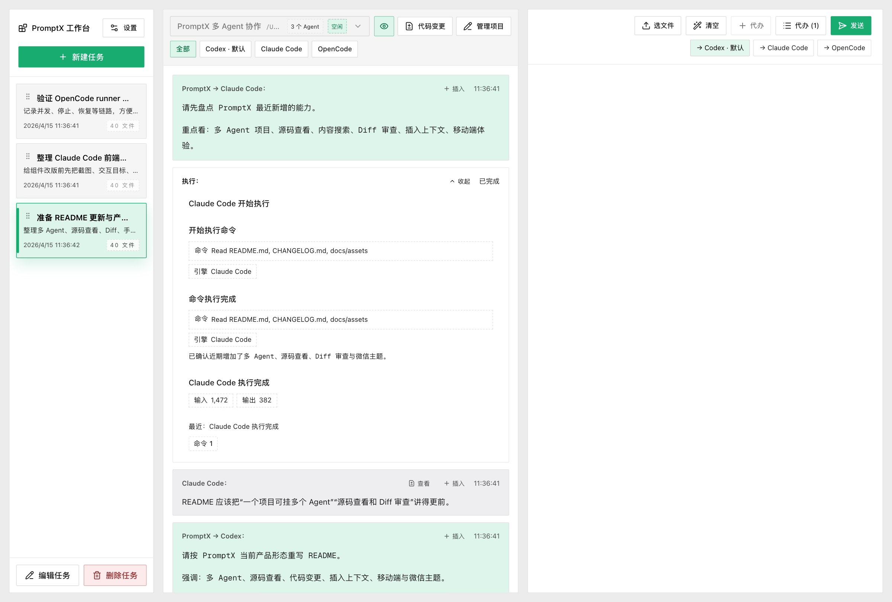
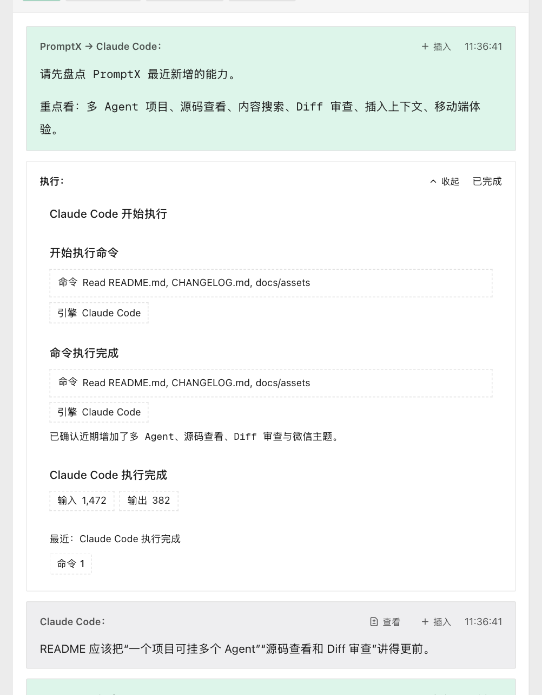
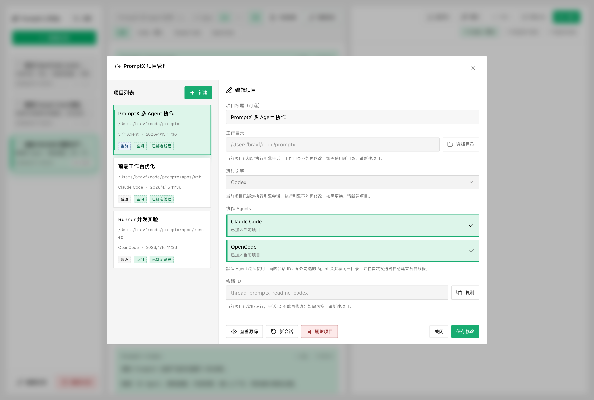
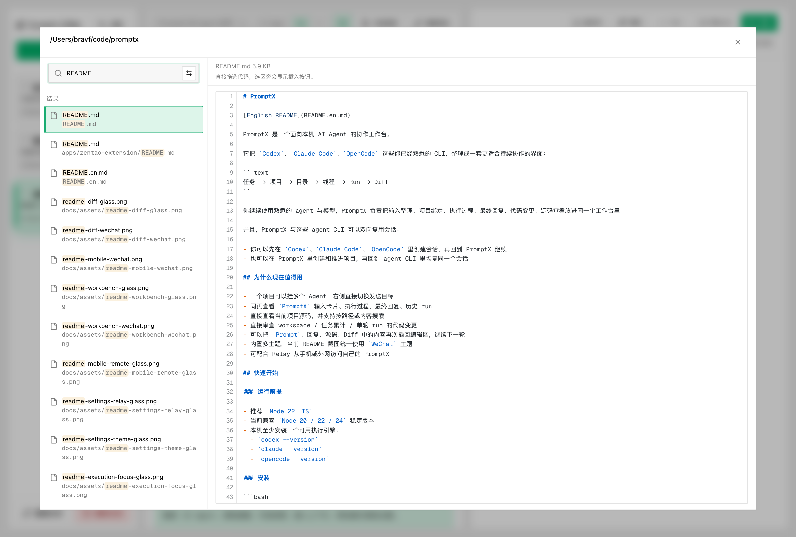
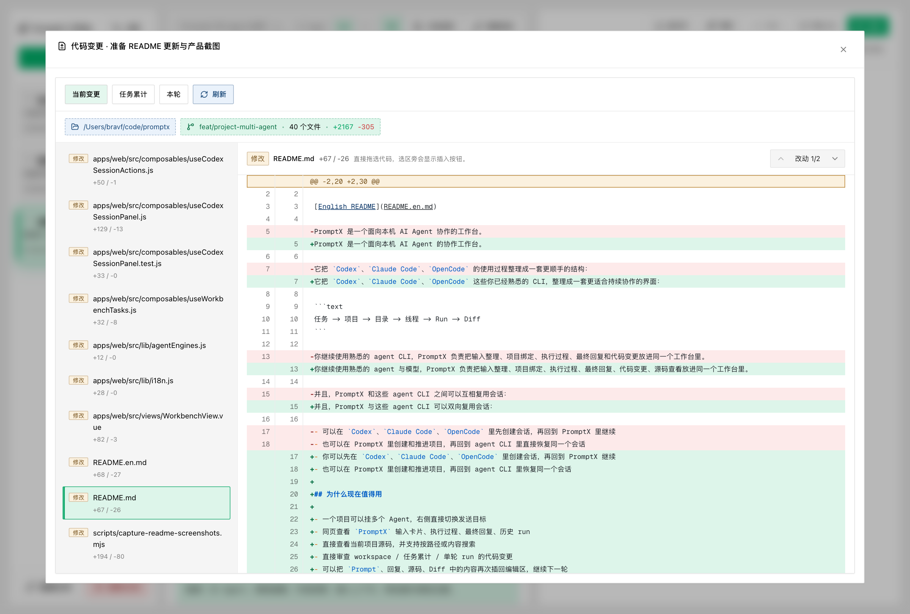
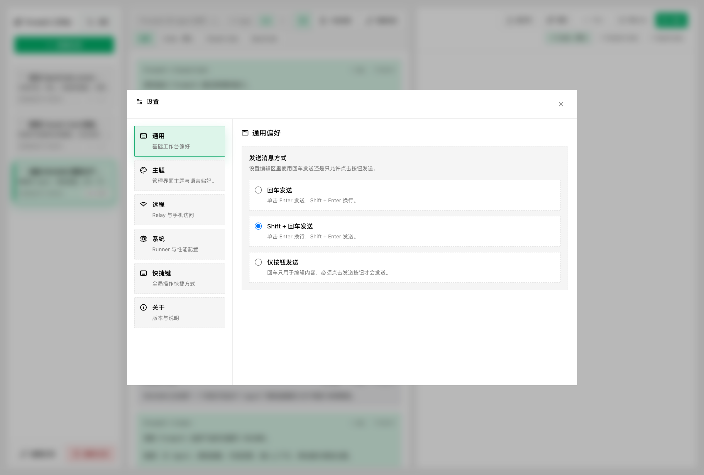
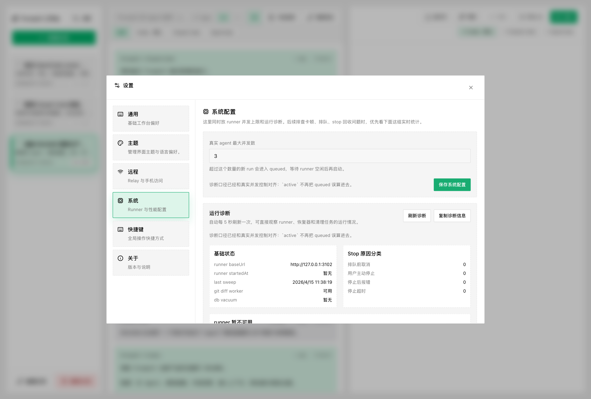
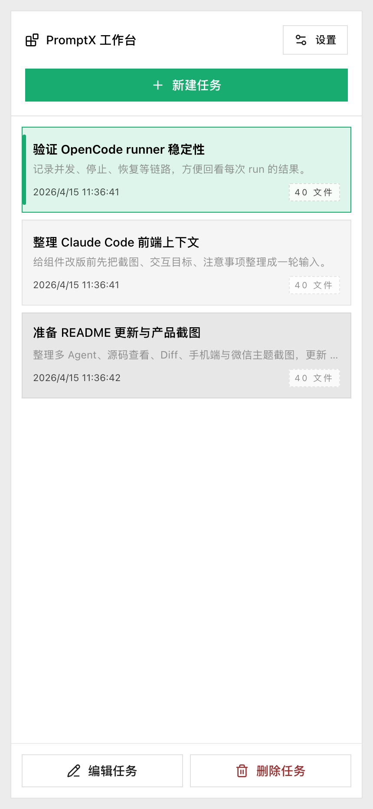

# PromptX

[中文 README](README.md)

PromptX is a local workspace for AI agents.

It takes the CLI tools you already use — `Codex`, `Claude Code`, and `OpenCode` — and organizes them into a workflow that is easier to keep running over time:

```text
Task -> Project -> Directory -> Thread -> Run -> Diff
```

You keep using the agent and model you already know. PromptX brings structured input, project binding, execution logs, final replies, code review, and source browsing into one workspace.

PromptX can also reuse sessions with these agent CLIs in both directions:

- Start a session in `Codex`, `Claude Code`, or `OpenCode`, then continue it inside PromptX
- Start and advance a project inside PromptX, then resume the same session back in the agent CLI

## Why It Is More Useful Now

- One project can attach multiple agents, and you can switch the send target from the right panel
- Review `PromptX` input cards, execution logs, final replies, and run history on the same page
- Browse the current project source code in read-only mode, with path and content search
- Inspect workspace-level, task-level, or per-run diffs without leaving the app
- Insert useful fragments from prompts, replies, source files, and diffs back into the editor
- Multiple built-in themes are available; the screenshots below use the `WeChat` theme
- Relay support lets you access your local PromptX from mobile or external networks

## Quick Start

### Requirements

- Recommended: `Node 22 LTS`
- Currently compatible with stable `Node 20 / 22 / 24`
- At least one supported engine installed locally:
  - `codex --version`
  - `claude --version`
  - `opencode --version`

### Install

```bash
npm install -g @muyichengshayu/promptx
promptx doctor
```

### Start

Default URL: `http://127.0.0.1:3000`

```bash
promptx start
promptx status
promptx stop
```

### Basic Workflow

1. Create a task and prepare the requirements, logs, screenshots, and files you want to send
2. Bind that task to a project
3. Choose a working directory, default engine, and optional collaborating agents
4. Pick which agent should receive this round from the right panel
5. Send and review logs, replies, source files, and diffs in the same workspace
6. Insert useful snippets back into the editor and continue the next round

## Core Features

- Structured input: text, images, `md`, `txt`, and `pdf`
- Project reuse: keep a stable directory and default engine/thread context
- Multi-agent collaboration: one project can attach `Codex`, `Claude Code`, and `OpenCode`
- Visible process: inspect execution logs, final replies, and run history
- Source browser: read-only source browsing with path search and content search
- Built-in diff review: inspect workspace, accumulated task, or per-run changes
- Context reinsertion: insert content from prompts, replies, source files, and diffs back into the editor
- Session interoperability: PromptX can reuse sessions with `Codex`, `Claude Code`, and `OpenCode`
- Remote access: connect from mobile or external networks through Relay

## Screenshots

All screenshots below use the `WeChat` theme.

### 1. Workspace Overview

See the task list, agent filter, input cards, execution logs, and final replies together.



### 2. Execution Logs and Replies

Review prompts, process logs, and final replies from the same round without bouncing between the terminal and diff tools.



### 3. Multi-Agent Project Management

One project can attach multiple agents while sharing the same directory. Each agent builds its own thread on first send.



### 4. Read-Only Source Browser

Use the directory tree and search results on the left, with file preview on the right, to inspect code and send context back into the editor.



### 5. Diff Review

Inspect workspace-level, task-level, or single-run changes to understand exactly what an agent changed.



### 6. Settings and System Panels

Theme, shortcuts, remote access, and system configuration all live in the same settings dialog.





### 7. Mobile

With Relay or local network access, you can keep reading replies and pushing work forward from your phone.



## Good Fit For

- Preparing requirements, screenshots, logs, and files before sending them to an agent
- Reusing the same project, directory, and thread across many rounds
- Coordinating multiple agents in one task without bouncing between terminals
- Reviewing execution logs, replies, source files, and code changes together
- Continuing local PromptX work from your phone when you are away from your desk

## Development

```bash
pnpm install
pnpm dev
pnpm build
```

Workspace structure:

- `apps/web`: Vue 3 + Vite frontend
- `apps/server`: Fastify backend
- `apps/runner`: standalone runner process
- `packages/shared`: shared constants and event protocol

## Remote Access

For Relay setup, see:

- `docs/relay-quickstart.md`

That guide covers:

- Connecting a local PromptX client to Relay
- Starting and managing Relay on a server
- Multi-tenant subdomain setup
- `promptx relay tenant add/list/remove`
- `promptx relay start/stop/restart/status`

## Zentao Extension

The repository includes a Zentao Chrome extension at `apps/zentao-extension`.

Notes:

- The published npm package does not include this extension directory
- If you need it, clone the repo and load it manually

Steps:

1. Open `chrome://extensions`
2. Enable developer mode
3. Click “Load unpacked”
4. Select `apps/zentao-extension`

## Notes

- PromptX is currently optimized for local-first, mostly single-user workflows
- Different engines may expose different tool capabilities and event richness
- Use Relay if you need cross-device access
- Runtime data is stored under `~/.promptx/`

## License

PromptX is licensed under `Apache-2.0`. See `LICENSE`.
