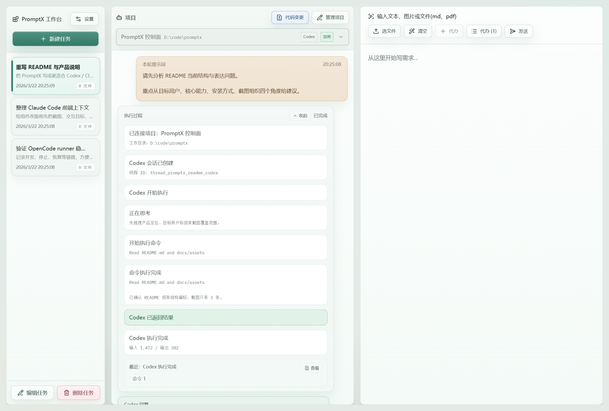
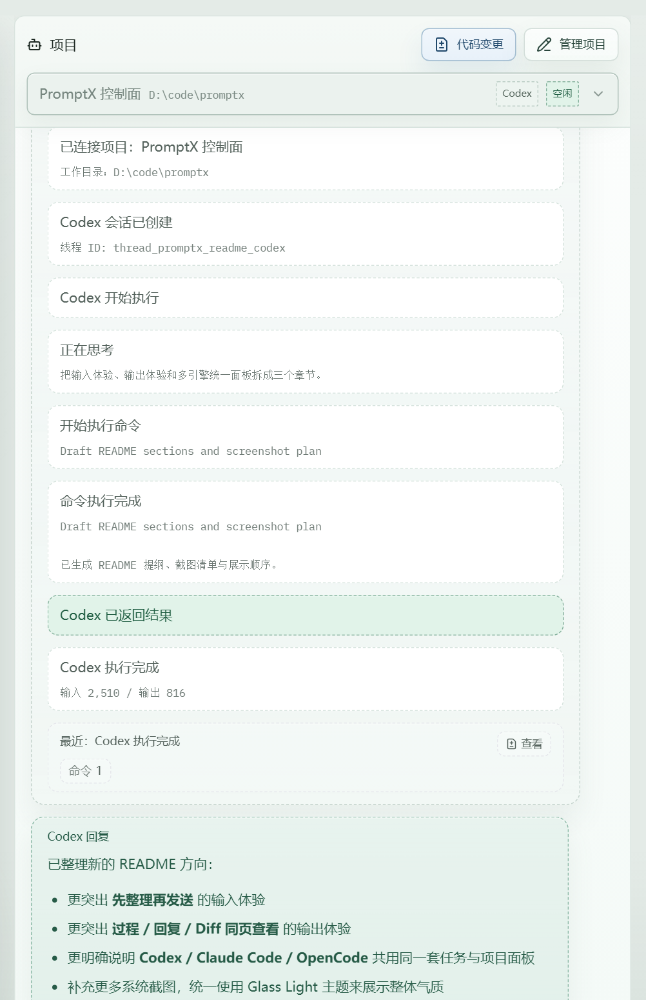
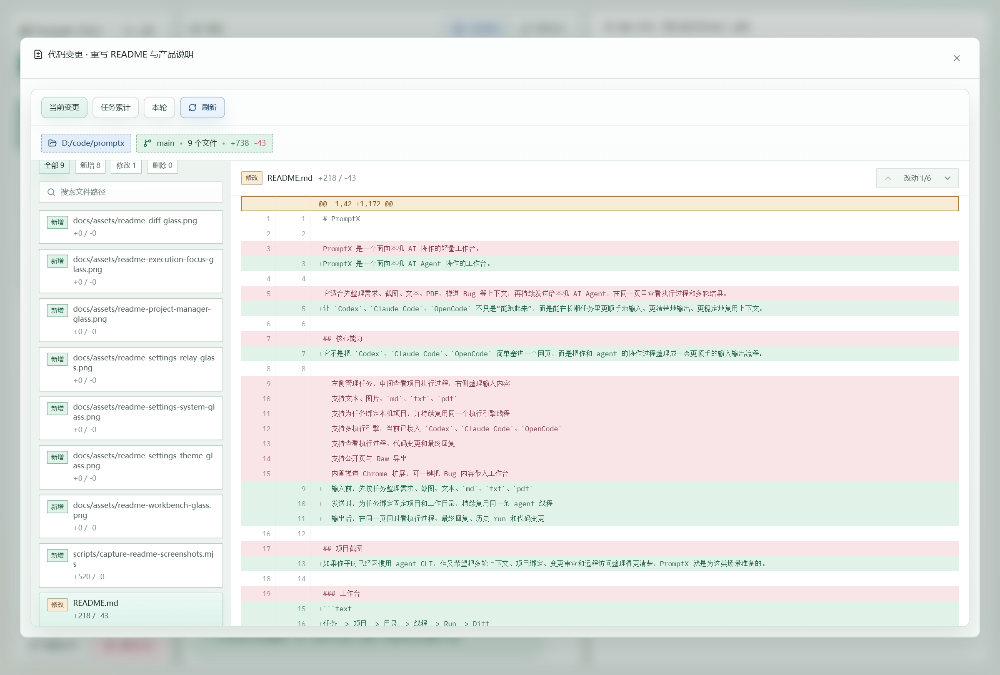
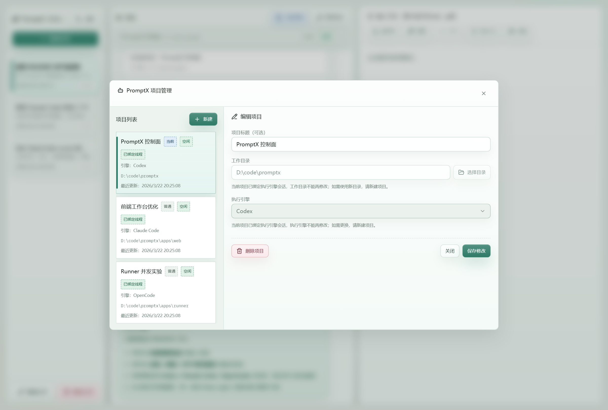
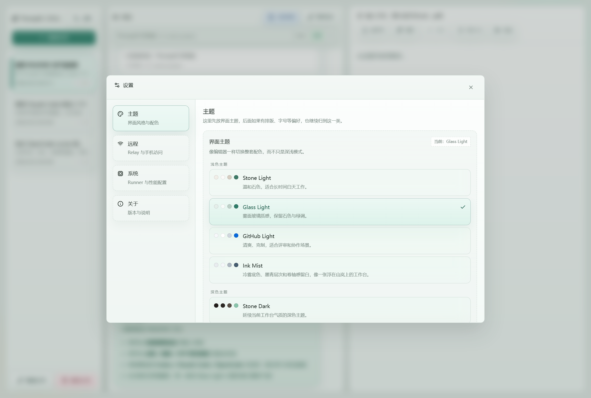
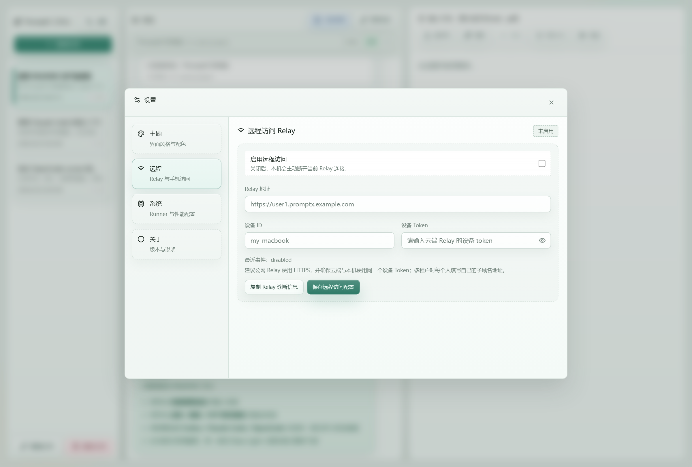
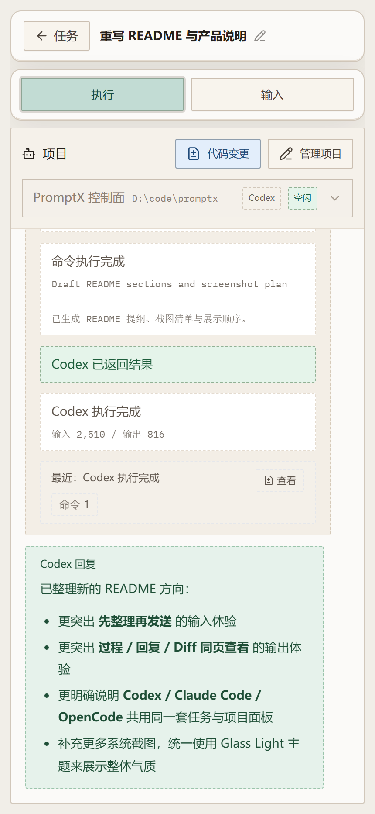
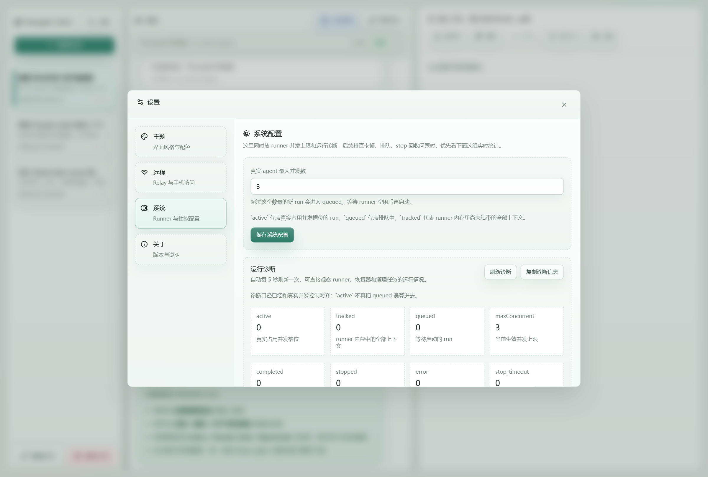

# PromptX

[English README](README.en.md)

PromptX 是一个面向本机 AI Agent 协作的工作台。

让 `Codex`、`Claude Code`、`OpenCode` 不只是“能跑起来”，而是能在长期任务里更顺手地输入、更清楚地输出、更稳定地复用上下文。

它不是把 `Codex`、`Claude Code`、`OpenCode` 简单塞进一个网页，而是把你和 agent 的协作过程整理成一套更顺手的输入输出流程：

- 输入前，先按任务整理需求、截图、文本、`md`、`txt`、`pdf`
- 发送时，为任务绑定固定项目和工作目录，持续复用同一条 agent 线程
- 输出后，在同一页同时看执行过程、最终回复、历史 run 和代码变更

如果你平时已经习惯用 agent CLI，但又希望把多轮上下文、项目绑定、变更审查和远程访问整理得更清楚，PromptX 就是为这类场景准备的。

```text
任务 -> 项目 -> 目录 -> 线程 -> Run -> Diff
```

## 一眼看懂 PromptX

- 你继续用熟悉的 `Codex`、`Claude Code`、`OpenCode`
- PromptX 负责把任务、项目、目录、线程和 run 历史整理成一个稳定工作台
- 输入侧更适合先整理上下文再发
- 输出侧更适合同页看过程、回复和 diff
- 对长期、多轮、要落代码的任务，比纯 CLI 窗口更省切换成本

## 你会得到什么

- 一个适合长期协作的任务工作台，而不是一次性 prompt 输入框
- 一个可复用的项目层，把工作目录和 agent 线程稳定绑在一起
- 一个能回看历史 run 的输出面板，不只看到最终一句回答
- 一个随手就能审查代码改动的 diff 视图
- 一个可以继续扩展到远程访问、通知和自动化的本机控制台
- 一套可选的远程访问能力：既支持自建 Relay，也支持接入作者已部署的远程服务

## 为什么更适合 Codex / Claude Code / OpenCode 用户

### 更好的输入体验

- 任务不是一段临时 prompt，而是一份可持续维护的上下文容器
- 可以把文本、截图、导入文件、补充说明和待办项集中整理后再发给 agent
- 一个任务可以绑定一个 PromptX 项目；一个项目再绑定固定工作目录
- 同一个目录可以复用同一个项目和线程，减少每轮重新交代环境的成本
- 输入区支持文本、图片、`md`、`txt`、`pdf`，适合把零散上下文先压成一轮高质量输入

### 更好的输出体验

- 中间面板直接展示执行过程，不用只盯着 CLI 输出
- 每次运行都会留下完整 run 记录，方便回看 prompt、过程日志和最终回复
- 内置代码变更视图，适合在改动落地后快速审查 workspace diff
- 系统面板能看到 runner 并发、排队、恢复和 stop 相关诊断
- 对“让 agent 改代码”这类任务，能更清楚地区分它想了什么、做了什么、改了什么

### 多引擎统一协作

- 当前已接入 `Codex`、`Claude Code`、`OpenCode`
- 前端统一用一套任务、项目、run、事件面板来承接多引擎协作
- 后续扩展更多 agent 时，输入区、过程面板和历史记录可以继续复用

## 系统截图

以下截图统一使用 `Glass Light` 毛玻璃主题，方便展示工作台层次和信息密度。

### 工作台总览

左侧管理任务，中间查看项目执行过程，右侧整理输入内容。



### 执行过程聚焦

把 agent 的过程日志、回合总结和最终回复放在一条连续视图里，更适合审查一轮 run 到底做了什么。



### 代码变更审查

除了过程日志和最终回复，还可以直接按工作区、任务累计或单次 run 查看代码改动。



### 项目管理

给任务绑定固定项目、固定目录和执行引擎，把 Codex / Claude Code / OpenCode 的上下文真正沉淀下来。



### 主题设置

内置多套主题，不只是简单深浅模式；截图里的毛玻璃皮肤就是 `Glass Light`。



### Relay 远程访问

如果你希望在手机或外部网络访问自己电脑上的 PromptX，可以直接在设置里接入 Relay。



### 移动端远程操作

PromptX 支持通过远程访问在手机上直接查看和继续操作任务，这也是很多 `Codex`、`Claude Code`、`OpenCode` 用户很在意的一点：离开电脑后，仍然能继续看执行状态、回看结果、继续推动任务。



### 系统诊断

可以直接查看 runner 并发、排队、恢复、stop 统计等运行状态。



## 核心工作流

### 1. 先整理，再发送

不要急着把一大段 prompt 直接糊给 agent。先把需求、截图、补充文档、日志和待办整理进任务里，再发出去，通常会更稳。

### 2. 把任务绑定到固定项目

项目会绑定工作目录和执行引擎。这样你下一轮回来时，不需要再从头解释“在哪个仓库、哪个目录、继续哪个线程”。

### 3. 同页回看过程、结果和代码变更

PromptX 把一次 run 拆成三类输出：

- 执行过程：agent 做了哪些动作
- 最终回复：这一轮交付了什么
- 代码变更：实际改了哪些文件、哪些 patch

对日常工程协作来说，这比只在终端里看滚动输出更容易判断质量。

### 4. 长任务继续滚动推进

当一个任务需要多轮推进时，PromptX 会把任务、项目、run 历史继续留在原地。你不会因为切了一次终端窗口，就把上下文结构打散。

## 适合什么场景

- 先整理需求、截图、日志、文件，再交给 `Codex` / `Claude Code` / `OpenCode`
- 一个项目要反复多轮协作，希望稳定复用同一个工作目录和线程
- 想把 agent 的执行过程、最终回答和代码改动放在同一页回看
- 想把本机工作台通过 Relay 或 Tailscale 暴露给手机或其他设备使用
- 想把 PromptX 放到远端长期在线使用，或给自己/小团队配一套固定远程入口
- 想把禅道 Bug、一段文档或一批文件快速转成可执行任务

## PromptX 帮你补上的，不是模型能力，而是协作层

| 你在 CLI 里常见的问题 | PromptX 怎么补上 |
| --- | --- |
| 多轮任务散在终端和笔记里 | 用任务把上下文、待办、导入文件集中起来 |
| 每次都要重新交代目录和项目背景 | 用固定项目绑定工作目录和线程 |
| 跑完以后很难系统回看 | 保留 run 历史、过程日志和最终回复 |
| 改了代码还要自己切回 git 看 | 直接在工作台里看代码变更 |
| 想从手机或别的设备继续看 | 通过 Relay / Tailscale 继续访问 |
| 想长期放到远端机器上使用 | 支持自建远程服务，也支持接入现成 Relay |

## 对不同 agent 用户分别意味着什么

### 对 Codex 用户

- 更适合把需求、附图和补充文件提前整理好，再发起一轮更完整的编码任务
- 更适合回看 thread 对应的 run 历史，不容易丢失上下文

### 对 Claude Code 用户

- 更适合在前端改版、文案整理、重构说明这类需要上下文组织的任务里使用
- 可以把“目标、约束、参考稿、附件”先变成任务，再交给 Claude Code 执行

### 对 OpenCode 用户

- 更适合把 runner 并发、执行过程和最终 diff 放到一个面板里审查
- 对本地实验型、多轮改动型任务更友好

## 运行前提

- Node `>=20.19.0 <21`、`>=22.13.0 <23` 或 `>=24 <25`
- 本机至少安装一个可用执行引擎
- 当前支持检查：
  - `codex --version`
  - `claude --version`
  - `opencode --version`
- 如使用 Codex，建议开启较高权限，避免文件读写和自动修改能力受限

## 安装

```bash
npm install -g @muyichengshayu/promptx
promptx doctor
```

## 启动

默认地址：`http://127.0.0.1:3000`

```bash
promptx start
promptx status
promptx stop
promptx relay start
```

其中：

- `promptx start`：启动本机 PromptX 工作台
- `promptx status`：查看当前服务状态
- `promptx stop`：停止本机服务
- `promptx relay start`：启动 Relay 接入流程，适合远程访问或自建中转

## 源码开发

```bash
pnpm install
pnpm dev
pnpm build
```

工作区结构：

- `apps/web`：Vue 3 + Vite 前端工作台
- `apps/server`：Fastify 服务端
- `apps/runner`：独立 runner 进程
- `packages/shared`：前后端共享常量与事件协议

README 截图生成脚本：`scripts/capture-readme-screenshots.mjs`

## 使用方式

1. 新建一个任务，按主题整理你要给 agent 的上下文
2. 在右侧输入区补充文本、截图、文件或导入 PDF
3. 在中间为当前任务选择一个 PromptX 项目
4. 给项目绑定工作目录和执行引擎
5. 点击发送，让 agent 在固定目录里继续工作
6. 在同一页查看执行过程、最终回复、历史 run 和代码变更

如果你希望更像“写给 agent 的执行单”，推荐的使用习惯是：

1. 先在任务里把目标、约束、上下文、附件放齐
2. 再绑定项目和目录
3. 再发送第一轮
4. 后续每轮都沿着同一个任务和项目继续推进

## 当前支持的执行引擎

- `Codex`
- `Claude Code`
- `OpenCode`

如需查看统一事件协议，可参考：

- `docs/agent-run-protocol.md`

## 远程访问 Relay

PromptX 现在已经支持完整的远程访问方案，不只是局域网临时打开一下页面。

你可以按自己的情况选择三种方式：

- 本机访问：默认只监听本机地址，适合个人日常使用
- 自建远程服务：把 Relay 部署到云服务器，给自己或小团队提供稳定入口
- 接入现成远程服务：作者自己维护了一套可用的远程服务，适合不想自己折腾部署的用户

如果你希望在手机上访问自己电脑上的 PromptX，或想把 Relay 部署到云服务器，请直接看：

- `docs/relay-quickstart.md`

文档中已经覆盖：

- 本地 PromptX 接入 Relay
- 云端 Relay 启动与后台管理
- 多租户子域名接入
- `promptx relay tenant add/list/remove`
- `promptx relay start/stop/restart/status`
- Nginx、DNS、健康检查与常见排查

### 自建远程服务

如果你希望完全掌控数据、域名和访问策略，推荐自建 Relay。

- 适合有云服务器、域名和基本运维能力的用户
- 可以给自己长期使用，也可以给小团队做内部入口
- 当前文档已经覆盖了启动、租户、多域名、Nginx 和常见排查

### 作者提供的远程服务

如果你不想自己部署，作者本人已经在线上维护了一套可用的远程服务。

- 可以更快体验远程访问能力
- 适合先试用，再决定是否自建
- 当前名额有限，如有需要可以联系作者申请开通账号

这一部分更偏体验支持，不保证长期无限量开放，建议有长期稳定需求的用户后续自建一套。

## 禅道扩展

仓库内置了禅道 Chrome 扩展：`apps/zentao-extension`

注意：

- `npm install -g @muyichengshayu/promptx` 安装的正式包不包含该扩展目录
- 如需使用禅道扩展，请先克隆仓库源码，再按下面方式手动加载

1. 打开 `chrome://extensions`
2. 开启开发者模式
3. 点击“加载已解压的扩展程序”
4. 选择 `apps/zentao-extension`

使用时保持 PromptX 已启动，然后在禅道 Bug 详情页点击右下角 `AI修复` 即可。

## 注意事项

- 当前以本机单用户使用为主，不包含账号体系和团队权限
- 默认仅监听本机地址；如需跨设备访问，建议配合 Tailscale、作者提供的远程服务或自建 Relay
- 不同执行引擎的工具能力、输出事件丰富度和稳定性会有差异
- 如果执行引擎运行在受限权限下，文件读写、修改和命令执行能力会明显受限

## 本地数据目录

运行数据默认保存在 `~/.promptx/`，包含：

```text
data/
uploads/
tmp/
run/
```

## 开源协议

本项目采用 `Apache-2.0` 开源协议，详见根目录 `LICENSE`。
